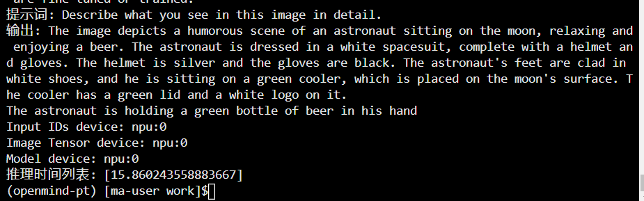
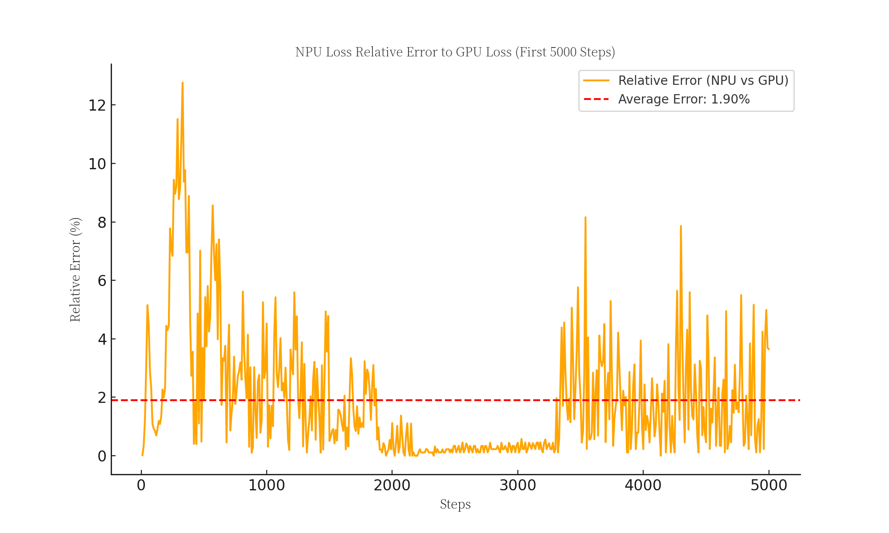

# 基于openmind和华为npu推理微调Bunny-Llama-3-8B-V

## 任务1：基于昇腾算力，直接运行提供的微调和推理脚本可跑通
 
### 推理
<details> <summary>推理代码和运行截图：</summary>
- 推理代码和运行截图：
    
    
    
    ```python
    from openmind import AutoModelForCausalLM, AutoTokenizer  
    from PIL import Image  
    import warnings  
    import torch  
    import os  
    import time
    
    # 抑制警告  
    warnings.filterwarnings('ignore', category=UserWarning)  
    warnings.filterwarnings('ignore', message='copying from a non-meta parameter')  
    warnings.filterwarnings('ignore', message='AutoNonVariableTypeMode is deprecated')  
    
    def load_local_siglip(base_path):  
        siglip_path = os.path.join(base_path, 'google', 'siglip-so400m-patch14-384')  
        return siglip_path if os.path.exists(siglip_path) else None  
    
    def multimodal_generation():  
        try:  
            import torch_npu
            # device = "npu:0"
            device = torch.device("npu:0")  # 更推荐的设备指定方式 
            torch.npu.set_device('npu:0')  
        except ImportError:  
            print("NPU device not available.")  
            return  
    
        try:  
            model_path = "/home/ma-user/work/pretrainmodel/Bunny-Llama-3-8B-V"  
            
            config = {  
                "mm_vision_tower": load_local_siglip(model_path) or "google/siglip-so400m-patch14-384"  
            }  
            
            model = AutoModelForCausalLM.from_pretrained(  
                model_path,  
                torch_dtype=torch.float16,  
                device_map='npu:0',  
                trust_remote_code=True,  
                local_files_only=True,  
                **config  
            )  
            print(f"Model is on device: {model.device}")  
            tokenizer = AutoTokenizer.from_pretrained(  
                model_path,  
                trust_remote_code=True,  
                local_files_only=True  
            )  
            inference_times = [] 
            # 性能计时  
            start_time = time.time()  
                
            # 选择一个本地图像  
            image_path = os.path.join(model_path, 'images', 'example_1.png')  
            image = Image.open(image_path) 
               # 构建提示词  
            # prompt = "Why is the image funny?" 
            prompt = "Describe what you see in this image in detail."  
            text = f"A chat between a curious user and an artificial intelligence assistant. The assistant gives helpful, detailed, and polite answers to the user's questions. USER: <image>\n{prompt} ASSISTANT:"  
    
            # 处理输入  
            text_chunks = [tokenizer(chunk).input_ids for chunk in text.split('<image>')]  
            input_ids = torch.tensor(  
                text_chunks[0] + [-200] + text_chunks[1][1:],   
                dtype=torch.long  
            ).unsqueeze(0).to(device)  
    
            # 处理图像  
            image_tensor = model.process_images([image], model.config).to(  
                dtype=model.dtype,   
                device=device  
            )  
    
            # 生成  
            output_ids = model.generate(  
                input_ids,  
                images=image_tensor,  
                max_new_tokens=100,  
                use_cache=True,  
                repetition_penalty=1.0  
            )[0]  
    
            # 解码输出  
            output_text = tokenizer.decode(  
                output_ids[input_ids.shape[1]:],   
                skip_special_tokens=True  
            ).strip() 
            # 计算推理时间  
            inference_time = time.time() - start_time  
            inference_times.append(inference_time)  
            print(f"提示词: {prompt}")  
            print(f"输出: {output_text}")  
            # 添加到生成后  
            print(f"Input IDs device: {input_ids.device}")  
            print(f"Image Tensor device: {image_tensor.device}")  
            print(f"Model device: {model.device}")
            print(f"推理时间列表: {inference_times}") 
        except Exception as e:  
            print(f"多模态推理发生错误: {e}")  
            import traceback  
            traceback.print_exc()  
    
    def main():  
        multimodal_generation()  
    
    if __name__ == "__main__":  
        main()
    ```
    
- 推理单元测试与运行截图：
    
    
    
    ```python
    import unittest  
    import torch  
    import os  
    from PIL import Image  
    import logging  
    from openmind import AutoModelForCausalLM, AutoTokenizer  
    import time  
    
    class MultimodalInferenceTest(unittest.TestCase):  
        model_path = "/home/ma-user/work/pretrainmodel/Bunny-Llama-3-8B-V"  
        device = None  
        model = None  
        tokenizer = None  
    
        @classmethod  
        def setUpClass(cls):  
            try:  
                import torch_npu  
                cls.device = torch.device("npu:0")  
                torch.npu.set_device('npu:0')  
            except ImportError:  
                cls.device = torch.device("cuda:0") if torch.cuda.is_available() else torch.device("cpu")  
    
            # 加载模型和分词器  
            cls.config = {  
                "mm_vision_tower": cls._load_local_siglip(cls.model_path) or "google/siglip-so400m-patch14-384"  
            }  
    
            cls.model = AutoModelForCausalLM.from_pretrained(  
                cls.model_path,  
                torch_dtype=torch.float16,  
                device_map=cls.device,  
                trust_remote_code=True,  
                local_files_only=True,  
                **cls.config  
            )  
    
            cls.tokenizer = AutoTokenizer.from_pretrained(  
                cls.model_path,  
                trust_remote_code=True,  
                local_files_only=True  
            )  
    
        @staticmethod  
        def _load_local_siglip(base_path):  
            """加载本地 SigLIP 模型路径"""  
            siglip_path = os.path.join(base_path, 'google', 'siglip-so400m-patch14-384')  
            return siglip_path if os.path.exists(siglip_path) else None  
    
        def test_model_device(self):  
            """测试模型是否正确加载到指定设备"""  
            self.assertIsNotNone(self.model, "模型未正确加载")  
            self.assertEqual(self.model.device.type, self.device.type)  
            self.assertEqual(self.model.device.index, self.device.index)  
    
        def test_multimodal_inference(self):  
            """测试多模态推理的基本功能"""  
            # 选择测试图像  
            image_path = os.path.join(self.model_path, 'images', 'example_1.png')  
            
            # 检查图像文件是否存在  
            self.assertTrue(os.path.exists(image_path), f"测试图像不存在: {image_path}")  
            
            image = Image.open(image_path)  
    
            # 构建提示词  
            prompt = "Describe what you see in this image in detail."  
            text = f"A chat between a curious user and an artificial intelligence assistant. The assistant gives helpful, detailed, and polite answers to the user's questions. USER: <image>\n{prompt} ASSISTANT:"  
    
            # 处理输入  
            text_chunks = [self.tokenizer(chunk).input_ids for chunk in text.split('<image>')]  
            input_ids = torch.tensor(  
                text_chunks[0] + [-200] + text_chunks[1][1:],  
                dtype=torch.long  
            ).unsqueeze(0).to(self.device)  
    
            # 处理图像  
            image_tensor = self.model.process_images([image], self.model.config).to(  
                dtype=self.model.dtype,  
                device=self.device  
            )  
    
            # 生成  
            output_ids = self.model.generate(  
                input_ids,  
                images=image_tensor,  
                max_new_tokens=100,  
                use_cache=True,  
                repetition_penalty=1.0  
            )[0]  
    
            # 解码输出  
            output_text = self.tokenizer.decode(  
                output_ids[input_ids.shape[1]:],  
                skip_special_tokens=True  
            ).strip()  
    
            # 断言  
            self.assertIsNotNone(output_text)  
            self.assertGreater(len(output_text), 0)  
    
        def test_inference_performance(self):  
            """测试推理性能"""  
            # 选择测试图像  
            image_path = os.path.join(self.model_path, 'images', 'example_1.png')  
            
            # 检查图像文件是否存在  
            self.assertTrue(os.path.exists(image_path), f"测试图像不存在: {image_path}")  
            
            image = Image.open(image_path)  
    
            # 构建提示词  
            prompt = "Describe what you see in this image in detail."  
            text = f"A chat between a curious user and an artificial intelligence assistant. The assistant gives helpful, detailed, and polite answers to the user's questions. USER: <image>\n{prompt} ASSISTANT:"  
    
            # 处理输入  
            text_chunks = [self.tokenizer(chunk).input_ids for chunk in text.split('<image>')]  
            input_ids = torch.tensor(  
                text_chunks[0] + [-200] + text_chunks[1][1:],  
                dtype=torch.long  
            ).unsqueeze(0).to(self.device)  
    
            # 处理图像  
            image_tensor = self.model.process_images([image], self.model.config).to(  
                dtype=self.model.dtype,  
                device=self.device  
            )  
    
            # 多次推理并计算平均时间  
            inference_times = []  
            num_runs = 5  
    
            for _ in range(num_runs):  
                start_time = time.time()  
                self.model.generate(  
                    input_ids,  
                    images=image_tensor,  
                    max_new_tokens=100,  
                    use_cache=True,  
                    repetition_penalty=1.0  
                )  
                inference_time = time.time() - start_time  
                inference_times.append(inference_time)  
    
            # 计算平均推理时间  
            avg_inference_time = sum(inference_times) / num_runs  
    
            # 性能阈值（根据实际情况调整）  
            max_acceptable_time = 10.0  # 秒  
    
            self.assertLess(avg_inference_time, max_acceptable_time,  
                            f"Average inference time {avg_inference_time:.2f}s exceeds threshold {max_acceptable_time}s")  
    
        def test_input_output_device_consistency(self):  
            """测试输入、输出和模型的设备一致性"""  
            # 选择测试图像  
            image_path = os.path.join(self.model_path, 'images', 'example_1.png')  
            
            # 检查图像文件是否存在  
            self.assertTrue(os.path.exists(image_path), f"测试图像不存在: {image_path}")  
            
            image = Image.open(image_path)  
    
            # 构建提示词  
            prompt = "Describe what you see in this image in detail."  
            text = f"A chat between a curious user and an artificial intelligence assistant. The assistant gives helpful, detailed, and polite answers to the user's questions. USER: <image>\n{prompt} ASSISTANT:"  
    
            # 处理输入  
            text_chunks = [self.tokenizer(chunk).input_ids for chunk in text.split('<image>')]  
            input_ids = torch.tensor(  
                text_chunks[0] + [-200] + text_chunks[1][1:],  
                dtype=torch.long  
            ).unsqueeze(0).to(self.device)  
    
            # 处理图像  
            image_tensor = self.model.process_images([image], self.model.config).to(  
                dtype=self.model.dtype,  
                device=self.device  
            )  
    
            # 验证设备一致性  
            self.assertEqual(input_ids.device, self.device)  
            self.assertEqual(image_tensor.device, self.device)  
            self.assertEqual(self.model.device.type, self.device.type)  
            self.assertEqual(self.model.device.index, self.device.index)  
    
    if __name__ == '__main__':  
        unittest.main()
    ```
    </details>     
- 推理日志
    
    2024-11-30 12:45:05,808 - root - INFO - 程序启动
    2024-11-30 12:45:05,808 - root - INFO - 开始多模态生成过程
    2024-11-30 12:45:12,247 - root - INFO - 成功初始化NPU设备: npu
    2024-11-30 12:45:12,248 - root - INFO - 准备加载模型，路径：/tmp/code/Bunny-Llama-3-8B-V
    2024-11-30 12:45:12,248 - root - INFO - Local SigLIP model found at: /tmp/code/Bunny-Llama-3-8B-V/google/siglip-so400m-patch14-384
    2024-11-30 12:45:16,626 - root - INFO - 模型加载成功，设备：npu:0
    2024-11-30 12:45:17,111 - root - INFO - 分词器加载成功
    2024-11-30 12:45:17,112 - root - INFO - 图像路径：/tmp/code/Bunny-Llama-3-8B-V/images/example_1.png
    2024-11-30 12:45:17,126 - root - INFO - 图像加载成功，大小：(1024, 640)
    2024-11-30 12:45:17,126 - root - INFO - 生成提示词: Describe what you see in this image in detail.
    2024-11-30 12:45:26,962 - root - INFO - 生成完成，输出文本：The image depicts a humorous scene of an astronaut sitting on the moon, relaxing and enjoying a beer. The astronaut is dressed in a white spacesuit, complete with a helmet and gloves. The helmet is silver and the gloves are black. The astronaut's feet are clad in white shoes, and he is sitting on a green cooler, which is placed on the moon's surface. The cooler has a green lid and a white logo on it.
    The astronaut is holding a green bottle of beer in his hand
    2024-11-30 12:45:26,963 - root - INFO - 推理时间：9.8504秒
    2024-11-30 12:45:26,963 - root - INFO - 推理时间列表: [9.850361347198486]
    2024-11-30 12:45:27,012 - root - INFO - 程序结束
    

### 微调

- 微调代码和运行截图
    
    
    
    ```python
    import os  
    import json  
    import torch  
    import torch_npu  # 确保导入  
    from dataclasses import dataclass, field  
    from typing import Optional, List, Dict  
    from PIL import Image  
    import pandas as pd
    import transformers  
    from transformers import TrainingArguments, Trainer,TrainerCallback 
    from peft import LoraConfig, get_peft_model, prepare_model_for_kbit_training  
    from datasets import Dataset 
    import os 
    import logging  
    import json
    import inspect  
    os.environ["TOKENIZERS_PARALLELISM"] = "false"
    from peft import PeftModel, PeftConfig  
    
    @dataclass  
    class ModelArguments:  
        model_name_or_path: Optional[str] = field(default=None)  
        vision_tower: Optional[str] = field(default=None)  
    
    @dataclass  
    class DataArguments:  
        data_path: str = field(default=None, metadata={"help": "Path to the training data."})  
        image_folder: Optional[str] = field(default=None)  
        lazy_preprocess: bool = field(default=True)  
    
    def setup_npu_environment():  
        """  
        设置 NPU 训练环境  
        """  
        try:  
            # 推荐的 NPU 设备设置方法  
            device = torch.device("npu")  
            torch.npu.set_device('npu')
            # 内存管理  
            torch_npu.npu.empty_cache()  # 清理缓存 
            print(f"Using NPU device: {device}")  
            return device  
        except ImportError:  
            print("NPU device not available.")  
            return torch.device("cpu")    
    def find_all_linear_names(model):  
        """  
        为 Bunny-Llama 模型定制的 LoRA 模块查找  
        """  
        lora_module_names = set()  
        for name, module in model.named_modules():  
            # 针对 Llama 模型的特定层  
            if isinstance(module, (  
                torch.nn.Linear,   
                transformers.models.llama.modeling_llama.LlamaAttention,  
                transformers.models.llama.modeling_llama.LlamaMLP  
            )):  
                # 处理 Attention 层的投影层  
                if 'q_proj' in name or 'k_proj' in name or 'v_proj' in name or 'o_proj' in name:  
                    lora_module_names.add(name)  
                # 处理 MLP 层  
                if 'gate_proj' in name or 'up_proj' in name or 'down_proj' in name:  
                    lora_module_names.add(name)  
    
        return list(lora_module_names)  
    def load_and_process_image(image_path, vision_tower_processor, device, base_image_folder):  
    
        full_image_path = os.path.join(base_image_folder, image_path)  
        if not os.path.exists(full_image_path):  
            # 尝试一些常见的路径变体  
            alternative_paths = [  
                os.path.join(base_image_folder, os.path.basename(image_path)),  
                os.path.join(base_image_folder, image_path.split('/')[-1])  
            ]  
            
            for alt_path in alternative_paths:  
                if os.path.exists(alt_path):  
                    print(f"Found alternative path: {alt_path}")  
                    full_image_path = alt_path  
                    break  
            else:  
                raise FileNotFoundError(f"Could not find image: {image_path}")  
        
        try:  
            image = Image.open(full_image_path).convert('RGB')  
            image_inputs = vision_tower_processor.image_processor(image, return_tensors="pt")
            return {k: v.to(device) for k, v in image_inputs.items()}  
        except Exception as e:  
            print(f"AAAAError processing image {full_image_path}: {e}")  
            raise  
    
    def preprocess_conversation(  
        example: Dict,   
        tokenizer,   
        vision_tower_processor,  
        image_folder,  # 基础图像文件夹  
        device  
    ) -> Dict:  
        """  
        Preprocess a single conversation example  
        """  
        conversations = example['conversations']  
        # 检查对话内容是否存在  
        if not conversations:  
            raise ValueError("Conversations list is empty.") 
        # 构建完整对话文本  
        text = ""  
        for conv in conversations:  
            if conv['from'] == 'human':   
                value = conv['value'].replace('<image>', '').strip()  
                text += f"Human: {value}\n"  
            else:  
                text += f"Assistant: {conv['value']}\n"  
            # 确保 text 是一个有效的字符串  
        if not isinstance(text, str):  
            raise ValueError(f"BBBSExpected string for text input, got {type(text)}")  
        # 处理图像  
        image_inputs = load_and_process_image(  
            example['image'],  # 使用相对路径   
            vision_tower_processor,   
            device,   
            image_folder  # 传入基础图像文件夹  
        )  
        # 分词  
        tokenized = tokenizer(  
            text,   
            truncation=True,   
            max_length=2048,   
            padding=True,   
            return_tensors="pt"  
        )  
        
        # 移动到指定设备  
        tokenized = {k: v.to(device) for k, v in tokenized.items()}  
        result = {  
            'input_ids': tokenized['input_ids'].squeeze(0) if 'input_ids' in tokenized else torch.empty(0),  
            'attention_mask': tokenized['attention_mask'].squeeze(0) if 'attention_mask' in tokenized else torch.empty(0),  
            'labels': tokenized['input_ids'].clone() if 'input_ids' in tokenized else torch.empty(0),  
            'pixel_values': image_inputs['pixel_values'].squeeze(0) if image_inputs['pixel_values'].numel() > 0 else torch.empty(0)  
        }  
        return result  
    
    from torch.utils.data import DataLoader  
    
     
    import torch  
    from typing import List, Dict, Any  
    
    class CustomDataCollator:  
        def __init__(self, tokenizer, max_length=None):  
            self.tokenizer = tokenizer  
            self.max_length = max_length  
        
        def __call__(self, features: List[Dict[str, Any]]):   
            #强制确保 pixel_values 存在  
            augmented_features = []  
            for feature in features:  
                # 如果特征中缺少 pixel_values，尝试从原始数据中恢复  
                if 'images' not in feature:  
                    print("警告：重建 images")  
                    # 这里可能需要根据你的具体数据结构调整  
                    feature['images'] = feature.get('images')  
                
                augmented_features.append(feature)  
            
    #         处理 labels 可能是二维的情况  
            processed_features = []  
            for f in augmented_features:  
                input_ids = f['input_ids']  
                attention_mask = f['attention_mask']  
                labels = f['labels']  
                images = f['images']  
                # 压缩 labels 的维度  
                if labels.dim() > 1:  
                    labels = labels.squeeze(0)  
                
                # 截断或填充  
                if self.max_length is not None:  
                    if input_ids.shape[0] > self.max_length:  
                        input_ids = input_ids[:self.max_length]  
                        attention_mask = attention_mask[:self.max_length]  
                        labels = labels[:self.max_length]  
                    else:  
                        pad_length = self.max_length - input_ids.shape[0]  
                        input_ids = torch.nn.functional.pad(  
                            input_ids,   
                            (0, pad_length),   
                            value=self.tokenizer.pad_token_id  
                        )  
                        attention_mask = torch.nn.functional.pad(  
                            attention_mask,   
                            (0, pad_length),   
                            value=0  
                        )  
                        labels = torch.nn.functional.pad(  
                            labels,   
                            (0, pad_length),   
                            value=-100  
                        )  
                
                processed_features.append({  
                    'input_ids': input_ids,  
                    'attention_mask': attention_mask,  
                    'labels': labels,  
                    'images': images 
                })  
            
            # 堆叠批次  
            batch = {  
                'input_ids': torch.stack([f['input_ids'] for f in processed_features]),  
                'attention_mask': torch.stack([f['attention_mask'] for f in processed_features]),  
                'labels': torch.stack([f['labels'] for f in processed_features]),  
                'images': torch.stack([f['images'] for f in processed_features]) 
            }  
            
            return batch
    def load_and_preprocess_data(  
        data_path: str,   
        tokenizer,   
        vision_tower_processor,  
        image_folder,  
        device  
    ) -> Dataset:  
        """  
        加载并预处理数据集  
        """ 
            # 详细的处理器信息打印  
        print("\n==== Vision Tower Processor Debugging ====")  
        print(f"Processor Type: {type(vision_tower_processor)}")  
        
        # 检查是否有图像处理器  
        if hasattr(vision_tower_processor, 'image_processor'):  
            print("Image Processor Available")  
            print(f"Image Processor Type: {type(vision_tower_processor.image_processor)}")  
            
            # 打印一些关键属性  
            image_processor = vision_tower_processor.image_processor   
        else:  
            print("No separate image_processor found")  
        
        print("==== End of Processor Debugging ====\n")
        # 读取 JSON 数据  
        with open(data_path, 'r',encoding='utf-8') as f:  
            raw_data = json.load(f)  
        
       # 预处理每个样本  
        processed_data = []  
        for example in raw_data:  
            result = preprocess_conversation(  
                example,  
                tokenizer,  
                vision_tower_processor,  
                image_folder,  
                device  
            )  
            
            processed_data.append(result)
            # 转换为 pandas DataFrame  
        dataset = Dataset.from_dict({  
            'input_ids':[item['input_ids'] for item in processed_data],  # 直接传入张量列表  
            'attention_mask': [item['attention_mask'] for item in processed_data],  
            'labels': [item['labels'] for item in processed_data],  
            'images': [item['pixel_values'] for item in processed_data] 
        })  
        
        # 设置 torch 格式  
        dataset.set_format(  
            type='torch',   
             columns=['input_ids', 'attention_mask', 'labels', 'images']  
        )  
        return  dataset 
    
    def train():
        # 设置 NPU 环境  
        device = setup_npu_environment()  
    
        # 解析命令行参数  
        parser = transformers.HfArgumentParser((ModelArguments, DataArguments, TrainingArguments))  
        model_args, data_args, training_args = parser.parse_args_into_dataclasses()  
        # 加载视觉塔处理器  
        vision_tower_processor = transformers.AutoProcessor.from_pretrained(
            model_args.vision_tower, 
            trust_remote_code=True,  # 允许执行自定义代码  
            local_files_only=True)  
    
        # 加载预训练模型和分词器
        config = {  
                "mm_vision_tower": "/tmp/code/Bunny-Llama-3-8B-V/google/siglip-so400m-patch14-384"  
            }
        model = transformers.AutoModelForCausalLM.from_pretrained(  
            model_args.model_name_or_path,  
            torch_dtype=torch.bfloat16, 
            device_map=device,  # 使用 NPU 设备
            trust_remote_code=True,  # 允许执行自定义代码  
            local_files_only=True,
            **config
        )  
        
        tokenizer = transformers.AutoTokenizer.from_pretrained(  
            model_args.model_name_or_path,  
            padding_side="right",  
            use_fast=True,
            trust_remote_code=True,  # 允许执行自定义代码  
            local_files_only=True
        )  
        tokenizer.pad_token = tokenizer.eos_token 
        model.resize_token_embeddings(len(tokenizer)) 
        # 准备模型进行 LoRA 训练  
        model = prepare_model_for_kbit_training(model)  
        
        # LoRA 配置  
        lora_config = LoraConfig(  
            r=64,  # LoRA 秩  
            lora_alpha=16,  
            target_modules=find_all_linear_names(model),  
            lora_dropout=0.1,  
            bias="none",  
            task_type="CAUSAL_LM"  
        ) 
        
        model = get_peft_model(model, lora_config) 
        model = model.to(device)  
        # 加载并预处理数据集  
        train_dataset = load_and_preprocess_data(  
            data_path=data_args.data_path,   
            tokenizer=tokenizer,  
            vision_tower_processor=vision_tower_processor,  
            image_folder=data_args.image_folder,  
            device=device  
        )  
        # 配置 NPU 训练参数  
        training_args.dataloader_num_workers = 4  # 根据实际情况调整  
        training_args.dataloader_pin_memory = True  
        # 打印样本详细信息 
        # 训练器 
        print(train_dataset[0])
        trainer = Trainer(  
            model=model,  
            args=training_args,  
            train_dataset=train_dataset,  
            tokenizer=tokenizer,  
            data_collator=CustomDataCollator(tokenizer, max_length=164),
        )  
        # 开始训练  
        trainer.train() 
        # 保存模型  
        trainer.save_state()  
        trainer.save_model(training_args.output_dir)
    
    if __name__ == "__main__":  
        train()
    ```
    
    ```powershell
    
    python [train.py](http://train.py/) \
    --model_name_or_path /tmp/code/Bunny-Llama-3-8B-V \
    --data_path /tmp/code/data/output_dataset/data_1000.json \
    --image_folder /tmp/code/data/output_dataset \
    --vision_tower /tmp/code/Bunny-Llama-3-8B-V/google/siglip-so400m-patch14-384 \
    --output_dir ./lora_output \
    --num_train_epochs 160 \
    --per_device_train_batch_size 4 \
    --gradient_accumulation_steps 8 \
    --learning_rate 2e-4 \
    --warmup_ratio 0.1 \
    --lr_scheduler_type "cosine" \
    --logging_steps 10 \
    --save_strategy "steps" \
    --save_steps 100 \
    --fp16 True \
    --logging_dir ./training_logs\
    --report_to tensorboard
    ```
    
- 微调单元测试与运行截图
    
    
    
    ```python
    import unittest  
    import os  
    import torch  
    import json  
    from PIL import Image  
    import numpy as np  
    import transformers  
    
    # 导入你的模块中的函数  
    from train import (  
        setup_npu_environment,  
        find_all_linear_names,  
        load_and_process_image,  
        preprocess_conversation,  
        CustomDataCollator  
    )  
    
    class TestMLModelUtils(unittest.TestCase):  
        def setUp(self):  
            # 测试前的准备工作  
            self.test_image_path = 'test_image.jpg'  
            self.test_data_path = 'test_data.json'  
            
            # 创建一个测试图像  
            test_image = np.random.randint(0, 255, (100, 100, 3), dtype=np.uint8)  
            Image.fromarray(test_image).save(self.test_image_path)  
            
            # 创建一个测试 JSON 数据文件  
            test_data = [{  
                'image': self.test_image_path,  
                'conversations': [  
                    {'from': 'human', 'value': 'What is in this image?'},  
                    {'from': 'assistant', 'value': 'This is a test image.'}  
                ]  
            }]  
            with open(self.test_data_path, 'w', encoding='utf-8') as f:  
                json.dump(test_data, f)  
    
        def tearDown(self):  
            # 测试后的清理工作  
            if os.path.exists(self.test_image_path):  
                os.remove(self.test_image_path)  
            if os.path.exists(self.test_data_path):  
                os.remove(self.test_data_path)  
    
        def test_setup_npu_environment(self):  
            # 测试 NPU 环境设置  
            device = setup_npu_environment()  
            self.assertIsNotNone(device)  
            self.assertTrue(torch.device(device).type in ['npu', 'cpu'])  
    
        def test_find_all_linear_names(self):  
            # 加载一个实际的模型来测试 find_all_linear_names 函数  
            try:     # 加载预训练模型和分词器
                config = {  
                        "mm_vision_tower": "/tmp/code/Bunny-Llama-3-8B-V/google/siglip-so400m-patch14-384"  
                    } 
                model = transformers.AutoModelForCausalLM.from_pretrained(  
                    "/tmp/code/Bunny-Llama-3-8B-V",   
                    torch_dtype=torch.bfloat16,  
                    trust_remote_code=True,
                    local_files_only=True,
                    **config
                )  
                
                # 使用实际模型测试 find_all_linear_names  
                linear_names = find_all_linear_names(model)  
                
                # 修改断言，检查返回的是否是非空列表  
                self.assertIsInstance(linear_names, list, "Result should be a list")  
                self.assertTrue(len(linear_names) > 0, "Linear names list should not be empty")  
                
                # 额外检查：确保列表中的元素是字符串  
                self.assertTrue(all(isinstance(name, str) for name in linear_names),   
                                "All names should be strings")  
            
            except Exception as e:  
                print(f"Error in test_find_all_linear_names: {e}")  
                # 如果模型加载失败，跳过测试  
                self.skipTest(f"Could not load model: {e}")  
    
        def test_load_and_process_image(self):  
            # 模拟必要的处理器和设备  
            try:  
                vision_tower_processor = transformers.AutoProcessor.from_pretrained(  
                    "/tmp/code/Bunny-Llama-3-8B-V/google/siglip-so400m-patch14-384",   
                    trust_remote_code=True,  
                    local_files_only=True,
                )  
                device = torch.device('cpu')  
    
                # 测试图像加载和处理  
                processed_image = load_and_process_image(  
                    self.test_image_path,   
                    vision_tower_processor,   
                    device,   
                    '.'  
                )  
                
                self.assertIn('pixel_values', processed_image)  
                self.assertTrue(torch.is_tensor(processed_image['pixel_values']))  
            
            except Exception as e:  
                print(f"Error in test_load_and_process_image: {e}")  
                self.skipTest(f"Could not process image: {e}")  
    
        def test_custom_data_collator(self):  
            # 加载实际的分词器  
            try:  
                tokenizer = transformers.AutoTokenizer.from_pretrained(  
                    "/tmp/code/Bunny-Llama-3-8B-V",   
                    trust_remote_code=True,  
                    local_files_only=True  
                )  
                tokenizer.pad_token = tokenizer.eos_token  
    
                collator = CustomDataCollator(tokenizer, max_length=10)  
    
                # 创建模拟特征  
                features = [  
                    {  
                        'input_ids': torch.randint(0, 100, (5,)),  
                        'attention_mask': torch.ones(5),  
                        'labels': torch.randint(0, 100, (5,)),  
                        'images': torch.rand(3, 224, 224)  
                    },  
                    {  
                        'input_ids': torch.randint(0, 100, (7,)),  
                        'attention_mask': torch.ones(7),  
                        'labels': torch.randint(0, 100, (7,)),  
                        'images': torch.rand(3, 224, 224)  
                    }  
                ]  
    
                # 测试数据整理  
                batch = collator(features)  
                
                self.assertIn('input_ids', batch)  
                self.assertIn('attention_mask', batch)  
                self.assertIn('labels', batch)  
                self.assertIn('images', batch)  
            
            except Exception as e:  
                print(f"Error in test_custom_data_collator: {e}")  
                self.skipTest(f"Could not create data collator: {e}")  
    
    if __name__ == '__main__':  
        unittest.main()
    ```
    
- 微调日志
    
    #使用30step测试微调日志
    
    2024-11-30 13:48:11,583 - root - INFO - 成功初始化NPU设备: npu
    2024-11-30 13:48:46,456 - root - INFO - 模型加载成功，设备：npu:0
    2024-11-30 13:48:46,938 - root - INFO - 分词器加载成功
    2024-11-30 13:49:59,693 - root - INFO - 数据加载成功,shape:(1000, 4)
    2024-11-30 13:49:59,774 - accelerate.utils.other - WARNING - Detected kernel version 4.14.0, which is below the recommended minimum of 5.5.0; this can cause the process to hang. It is recommended to upgrade the kernel to the minimum version or higher.
    2024-11-30 13:49:59,792 - root - INFO - 开始训练
    2024-11-30 13:52:12,876 - root - INFO - 训练完成
    2024-11-30 13:53:42,837 - root - INFO - 成功初始化NPU设备: npu
    2024-11-30 13:54:51,881 - root - INFO - 模型加载成功，设备：npu:0
    2024-11-30 13:54:52,371 - root - INFO - 分词器加载成功
    2024-11-30 13:57:43,550 - root - INFO - 数据加载成功,shape:(1000, 4)
    2024-11-30 13:57:43,831 - accelerate.utils.other - WARNING - Detected kernel version 4.14.0, which is below the recommended minimum of 5.5.0; this can cause the process to hang. It is recommended to upgrade the kernel to the minimum version or higher.
    2024-11-30 13:57:43,883 - root - INFO - 开始训练
    2024-11-30 13:59:49,649 - root - INFO - 训练完成
    

## 任务2：推理结果和GPU或者CPU对齐

- NPU推理结果
    
    
    
- NPU推理日志
    
    2024-11-30 12:45:05,808 - root - INFO - 程序启动
    2024-11-30 12:45:05,808 - root - INFO - 开始多模态生成过程
    2024-11-30 12:45:12,247 - root - INFO - 成功初始化NPU设备: npu
    2024-11-30 12:45:12,248 - root - INFO - 准备加载模型，路径：/tmp/code/Bunny-Llama-3-8B-V
    2024-11-30 12:45:12,248 - root - INFO - Local SigLIP model found at: /tmp/code/Bunny-Llama-3-8B-V/google/siglip-so400m-patch14-384
    2024-11-30 12:45:16,626 - root - INFO - 模型加载成功，设备：npu:0
    2024-11-30 12:45:17,111 - root - INFO - 分词器加载成功
    2024-11-30 12:45:17,112 - root - INFO - 图像路径：/tmp/code/Bunny-Llama-3-8B-V/images/example_1.png
    2024-11-30 12:45:17,126 - root - INFO - 图像加载成功，大小：(1024, 640)
    2024-11-30 12:45:17,126 - root - INFO - 生成提示词: Describe what you see in this image in detail.
    2024-11-30 12:45:26,962 - root - INFO - 生成完成，输出文本：The image depicts a humorous scene of an astronaut sitting on the moon, relaxing and enjoying a beer. The astronaut is dressed in a white spacesuit, complete with a helmet and gloves. The helmet is silver and the gloves are black. The astronaut's feet are clad in white shoes, and he is sitting on a green cooler, which is placed on the moon's surface. The cooler has a green lid and a white logo on it.
    The astronaut is holding a green bottle of beer in his hand
    2024-11-30 12:45:26,963 - root - INFO - 推理时间：9.8504秒
    2024-11-30 12:45:26,963 - root - INFO - 推理时间列表: [9.850361347198486]
    2024-11-30 12:45:27,012 - root - INFO - 程序结束
    
- NPU单元测试
    
    
    
    ```python
    import unittest  
    import torch  
    import os  
    from PIL import Image  
    import logging  
    from openmind import AutoModelForCausalLM, AutoTokenizer  
    import time  
    
    class MultimodalInferenceTest(unittest.TestCase):  
        model_path = "/home/ma-user/work/pretrainmodel/Bunny-Llama-3-8B-V"  
        device = None  
        model = None  
        tokenizer = None  
    
        @classmethod  
        def setUpClass(cls):  
            try:  
                import torch_npu  
                cls.device = torch.device("npu:0")  
                torch.npu.set_device('npu:0')  
            except ImportError:  
                cls.device = torch.device("cuda:0") if torch.cuda.is_available() else torch.device("cpu")  
    
            # 加载模型和分词器  
            cls.config = {  
                "mm_vision_tower": cls._load_local_siglip(cls.model_path) or "google/siglip-so400m-patch14-384"  
            }  
    
            cls.model = AutoModelForCausalLM.from_pretrained(  
                cls.model_path,  
                torch_dtype=torch.float16,  
                device_map=cls.device,  
                trust_remote_code=True,  
                local_files_only=True,  
                **cls.config  
            )  
    
            cls.tokenizer = AutoTokenizer.from_pretrained(  
                cls.model_path,  
                trust_remote_code=True,  
                local_files_only=True  
            )  
    
        @staticmethod  
        def _load_local_siglip(base_path):  
            """加载本地 SigLIP 模型路径"""  
            siglip_path = os.path.join(base_path, 'google', 'siglip-so400m-patch14-384')  
            return siglip_path if os.path.exists(siglip_path) else None  
    
        def test_model_device(self):  
            """测试模型是否正确加载到指定设备"""  
            self.assertIsNotNone(self.model, "模型未正确加载")  
            self.assertEqual(self.model.device.type, self.device.type)  
            self.assertEqual(self.model.device.index, self.device.index)  
    
        def test_multimodal_inference(self):  
            """测试多模态推理的基本功能"""  
            # 选择测试图像  
            image_path = os.path.join(self.model_path, 'images', 'example_1.png')  
            
            # 检查图像文件是否存在  
            self.assertTrue(os.path.exists(image_path), f"测试图像不存在: {image_path}")  
            
            image = Image.open(image_path)  
    
            # 构建提示词  
            prompt = "Describe what you see in this image in detail."  
            text = f"A chat between a curious user and an artificial intelligence assistant. The assistant gives helpful, detailed, and polite answers to the user's questions. USER: <image>\n{prompt} ASSISTANT:"  
    
            # 处理输入  
            text_chunks = [self.tokenizer(chunk).input_ids for chunk in text.split('<image>')]  
            input_ids = torch.tensor(  
                text_chunks[0] + [-200] + text_chunks[1][1:],  
                dtype=torch.long  
            ).unsqueeze(0).to(self.device)  
    
            # 处理图像  
            image_tensor = self.model.process_images([image], self.model.config).to(  
                dtype=self.model.dtype,  
                device=self.device  
            )  
    
            # 生成  
            output_ids = self.model.generate(  
                input_ids,  
                images=image_tensor,  
                max_new_tokens=100,  
                use_cache=True,  
                repetition_penalty=1.0  
            )[0]  
    
            # 解码输出  
            output_text = self.tokenizer.decode(  
                output_ids[input_ids.shape[1]:],  
                skip_special_tokens=True  
            ).strip()  
    
            # 断言  
            self.assertIsNotNone(output_text)  
            self.assertGreater(len(output_text), 0)  
    
        def test_inference_performance(self):  
            """测试推理性能"""  
            # 选择测试图像  
            image_path = os.path.join(self.model_path, 'images', 'example_1.png')  
            
            # 检查图像文件是否存在  
            self.assertTrue(os.path.exists(image_path), f"测试图像不存在: {image_path}")  
            
            image = Image.open(image_path)  
    
            # 构建提示词  
            prompt = "Describe what you see in this image in detail."  
            text = f"A chat between a curious user and an artificial intelligence assistant. The assistant gives helpful, detailed, and polite answers to the user's questions. USER: <image>\n{prompt} ASSISTANT:"  
    
            # 处理输入  
            text_chunks = [self.tokenizer(chunk).input_ids for chunk in text.split('<image>')]  
            input_ids = torch.tensor(  
                text_chunks[0] + [-200] + text_chunks[1][1:],  
                dtype=torch.long  
            ).unsqueeze(0).to(self.device)  
    
            # 处理图像  
            image_tensor = self.model.process_images([image], self.model.config).to(  
                dtype=self.model.dtype,  
                device=self.device  
            )  
    
            # 多次推理并计算平均时间  
            inference_times = []  
            num_runs = 5  
    
            for _ in range(num_runs):  
                start_time = time.time()  
                self.model.generate(  
                    input_ids,  
                    images=image_tensor,  
                    max_new_tokens=100,  
                    use_cache=True,  
                    repetition_penalty=1.0  
                )  
                inference_time = time.time() - start_time  
                inference_times.append(inference_time)  
    
            # 计算平均推理时间  
            avg_inference_time = sum(inference_times) / num_runs  
    
            # 性能阈值（根据实际情况调整）  
            max_acceptable_time = 10.0  # 秒  
    
            self.assertLess(avg_inference_time, max_acceptable_time,  
                            f"Average inference time {avg_inference_time:.2f}s exceeds threshold {max_acceptable_time}s")  
    
        def test_input_output_device_consistency(self):  
            """测试输入、输出和模型的设备一致性"""  
            # 选择测试图像  
            image_path = os.path.join(self.model_path, 'images', 'example_1.png')  
            
            # 检查图像文件是否存在  
            self.assertTrue(os.path.exists(image_path), f"测试图像不存在: {image_path}")  
            
            image = Image.open(image_path)  
    
            # 构建提示词  
            prompt = "Describe what you see in this image in detail."  
            text = f"A chat between a curious user and an artificial intelligence assistant. The assistant gives helpful, detailed, and polite answers to the user's questions. USER: <image>\n{prompt} ASSISTANT:"  
    
            # 处理输入  
            text_chunks = [self.tokenizer(chunk).input_ids for chunk in text.split('<image>')]  
            input_ids = torch.tensor(  
                text_chunks[0] + [-200] + text_chunks[1][1:],  
                dtype=torch.long  
            ).unsqueeze(0).to(self.device)  
    
            # 处理图像  
            image_tensor = self.model.process_images([image], self.model.config).to(  
                dtype=self.model.dtype,  
                device=self.device  
            )  
    
            # 验证设备一致性  
            self.assertEqual(input_ids.device, self.device)  
            self.assertEqual(image_tensor.device, self.device)  
            self.assertEqual(self.model.device.type, self.device.type)  
            self.assertEqual(self.model.device.index, self.device.index)  
    
    if __name__ == '__main__':  
        unittest.main()
    ```
    
- GPU推理结果
    
    
    
- GPU推理日志
    
    2024-12-01 15:00:09,503 - root - INFO - 程序启动
    2024-12-01 15:00:09,504 - root - INFO - 开始多模态生成过程
    2024-12-01 15:00:09,504 - root - INFO - 成功初始化GPU设备: cuda:0
    2024-12-01 15:00:09,504 - root - INFO - 准备加载模型，路径：/tmp/code/Bunny-Llama-3-8B-V
    2024-12-01 15:00:09,506 - root - INFO - Local SigLIP model found at: /tmp/code/Bunny-Llama-3-8B-V/google/siglip-so400m-patch14-384
    2024-12-01 15:00:35,806 - root - INFO - 模型加载成功，设备：cuda:0
    2024-12-01 15:00:36,169 - root - INFO - 分词器加载成功
    2024-12-01 15:00:36,169 - root - INFO - 图像路径：/tmp/code/Bunny-Llama-3-8B-V/images/example_1.png
    2024-12-01 15:00:36,182 - root - INFO - 图像加载成功，大小：(1024, 640)
    2024-12-01 15:00:36,182 - root - INFO - 生成提示词: Describe what you see in this image in detail.
    2024-12-01 15:00:41,057 - root - INFO - 生成完成，输出文本：The image depicts a humorous scene of an astronaut sitting on the moon, relaxing and enjoying a beer. The astronaut is dressed in a white spacesuit, complete with a helmet and gloves. The helmet is silver and the gloves are black. The astronaut's feet are clad in white shoes, and he is sitting on a green cooler, which is placed on the moon's surface. The cooler has a green lid and a white logo on it.
    The astronaut is holding a green bottle of beer in his hand
    2024-12-01 15:00:41,057 - root - INFO - 推理时间：4.8884秒
    2024-12-01 15:00:41,057 - root - INFO - 推理时间列表: [4.888402462005615]
    2024-12-01 15:00:41,084 - root - INFO - 程序结束
    
- GPU单元测试
    
    
    
    ```python
    import unittest  
    import torch  
    import os  
    from PIL import Image  
    import logging  
    from openmind import AutoModelForCausalLM, AutoTokenizer  
    import time  
    
    class MultimodalInferenceTest(unittest.TestCase):  
        model_path = "/tmp/code/Bunny-Llama-3-8B-V"  
        device = None  
        model = None  
        tokenizer = None  
    
        @classmethod  
        def setUpClass(cls):  
            try:  
                import torch_npu  
                cls.device = torch.device("cuda:0")  
                # torch.npu.set_device('npu:0')  
            except ImportError:  
                cls.device = torch.device("cuda:0") if torch.cuda.is_available() else torch.device("cpu")  
    
            # 加载模型和分词器  
            cls.config = {  
                "mm_vision_tower": cls._load_local_siglip(cls.model_path) or "google/siglip-so400m-patch14-384"  
            }  
    
            cls.model = AutoModelForCausalLM.from_pretrained(  
                cls.model_path,  
                torch_dtype=torch.float16,  
                device_map=cls.device,  
                trust_remote_code=True,  
                local_files_only=True,  
                **cls.config  
            )  
    
            cls.tokenizer = AutoTokenizer.from_pretrained(  
                cls.model_path,  
                trust_remote_code=True,  
                local_files_only=True  
            )  
    
        @staticmethod  
        def _load_local_siglip(base_path):  
            """加载本地 SigLIP 模型路径"""  
            siglip_path = os.path.join(base_path, 'google', 'siglip-so400m-patch14-384')  
            return siglip_path if os.path.exists(siglip_path) else None  
    
        def test_model_device(self):  
            """测试模型是否正确加载到指定设备"""  
            self.assertIsNotNone(self.model, "模型未正确加载")  
            self.assertEqual(self.model.device.type, self.device.type)  
            self.assertEqual(self.model.device.index, self.device.index)  
    
        def test_multimodal_inference(self):  
            """测试多模态推理的基本功能"""  
            # 选择测试图像  
            image_path = os.path.join(self.model_path, 'images', 'example_1.png')  
            
            # 检查图像文件是否存在  
            self.assertTrue(os.path.exists(image_path), f"测试图像不存在: {image_path}")  
            
            image = Image.open(image_path)  
    
            # 构建提示词  
            prompt = "Describe what you see in this image in detail."  
            text = f"A chat between a curious user and an artificial intelligence assistant. The assistant gives helpful, detailed, and polite answers to the user's questions. USER: <image>\n{prompt} ASSISTANT:"  
    
            # 处理输入  
            text_chunks = [self.tokenizer(chunk).input_ids for chunk in text.split('<image>')]  
            input_ids = torch.tensor(  
                text_chunks[0] + [-200] + text_chunks[1][1:],  
                dtype=torch.long  
            ).unsqueeze(0).to(self.device)  
    
            # 处理图像  
            image_tensor = self.model.process_images([image], self.model.config).to(  
                dtype=self.model.dtype,  
                device=self.device  
            )  
    
            # 生成  
            output_ids = self.model.generate(  
                input_ids,  
                images=image_tensor,  
                max_new_tokens=100,  
                use_cache=True,  
                repetition_penalty=1.0  
            )[0]  
    
            # 解码输出  
            output_text = self.tokenizer.decode(  
                output_ids[input_ids.shape[1]:],  
                skip_special_tokens=True  
            ).strip()  
    
            # 断言  
            self.assertIsNotNone(output_text)  
            self.assertGreater(len(output_text), 0)  
    
        def test_inference_performance(self):  
            """测试推理性能"""  
            # 选择测试图像  
            image_path = os.path.join(self.model_path, 'images', 'example_1.png')  
            
            # 检查图像文件是否存在  
            self.assertTrue(os.path.exists(image_path), f"测试图像不存在: {image_path}")  
            
            image = Image.open(image_path)  
    
            # 构建提示词  
            prompt = "Describe what you see in this image in detail."  
            text = f"A chat between a curious user and an artificial intelligence assistant. The assistant gives helpful, detailed, and polite answers to the user's questions. USER: <image>\n{prompt} ASSISTANT:"  
    
            # 处理输入  
            text_chunks = [self.tokenizer(chunk).input_ids for chunk in text.split('<image>')]  
            input_ids = torch.tensor(  
                text_chunks[0] + [-200] + text_chunks[1][1:],  
                dtype=torch.long  
            ).unsqueeze(0).to(self.device)  
    
            # 处理图像  
            image_tensor = self.model.process_images([image], self.model.config).to(  
                dtype=self.model.dtype,  
                device=self.device  
            )  
    
            # 多次推理并计算平均时间  
            inference_times = []  
            num_runs = 5  
    
            for _ in range(num_runs):  
                start_time = time.time()  
                self.model.generate(  
                    input_ids,  
                    images=image_tensor,  
                    max_new_tokens=100,  
                    use_cache=True,  
                    repetition_penalty=1.0  
                )  
                inference_time = time.time() - start_time  
                inference_times.append(inference_time)  
    
            # 计算平均推理时间  
            avg_inference_time = sum(inference_times) / num_runs  
    
            # 性能阈值（根据实际情况调整）  
            max_acceptable_time = 10.0  # 秒  
    
            self.assertLess(avg_inference_time, max_acceptable_time,  
                            f"Average inference time {avg_inference_time:.2f}s exceeds threshold {max_acceptable_time}s")  
    
        def test_input_output_device_consistency(self):  
            """测试输入、输出和模型的设备一致性"""  
            # 选择测试图像  
            image_path = os.path.join(self.model_path, 'images', 'example_1.png')  
            
            # 检查图像文件是否存在  
            self.assertTrue(os.path.exists(image_path), f"测试图像不存在: {image_path}")  
            
            image = Image.open(image_path)  
    
            # 构建提示词  
            prompt = "Describe what you see in this image in detail."  
            text = f"A chat between a curious user and an artificial intelligence assistant. The assistant gives helpful, detailed, and polite answers to the user's questions. USER: <image>\n{prompt} ASSISTANT:"  
    
            # 处理输入  
            text_chunks = [self.tokenizer(chunk).input_ids for chunk in text.split('<image>')]  
            input_ids = torch.tensor(  
                text_chunks[0] + [-200] + text_chunks[1][1:],  
                dtype=torch.long  
            ).unsqueeze(0).to(self.device)  
    
            # 处理图像  
            image_tensor = self.model.process_images([image], self.model.config).to(  
                dtype=self.model.dtype,  
                device=self.device  
            )  
    
            # 验证设备一致性  
            self.assertEqual(input_ids.device, self.device)  
            self.assertEqual(image_tensor.device, self.device)  
            self.assertEqual(self.model.device.type, self.device.type)  
            self.assertEqual(self.model.device.index, self.device.index)  
    
    if __name__ == '__main__':  
        unittest.main()
    ```
    

## 任务3：微调loss有明显下降趋势，5000 step 和GPU平均差异小于2%

- NPUloss下降曲线截图
    
    
    
- 出图日志
    
    2024-12-01 15:25:05,351 - INFO - 开始读取JSON文件: picture/trainer_state_NPU.json
    2024-12-01 15:25:05,361 - INFO - JSON文件读取成功
    2024-12-01 15:25:05,361 - INFO - 开始提取log_history数据
    2024-12-01 15:25:05,362 - INFO - 开始提取step和loss值
    2024-12-01 15:25:05,362 - INFO - 成功提取数据点数量: 500
    2024-12-01 15:25:05,363 - INFO - 开始创建loss图表
    2024-12-01 15:25:05,618 - INFO - 图表已保存为npu_loss.png
    2024-12-01 15:25:10,840 - INFO - 图表显示完成
    
- 单元测试
    
    
    
    ```python
    import unittest
    import json
    import os
    import matplotlib.pyplot as plt
    from unittest.mock import patch, mock_open
    from pic import *
    
    class TestPlotLoss(unittest.TestCase):
        def setUp(self):
            # 测试用的JSON数据
            self.test_data = {
                "log_history": [
                    {"step": 1, "loss": 0.5},
                    {"step": 2, "loss": 0.3},
                    {"step": 3, "loss": 0.1}
                ]
            }
            self.json_str = json.dumps(self.test_data)
    
        def test_json_file_reading(self):
            """测试JSON文件读取功能"""
            with patch('builtins.open', mock_open(read_data=self.json_str)):
                with open('dummy_path.json', 'r') as file:
                    data = json.load(file)
                self.assertEqual(data, self.test_data)
                self.assertTrue('log_history' in data)
    
        def test_data_extraction(self):
            """测试数据提取功能"""
            log_history = self.test_data['log_history']
            steps = [entry['step'] for entry in log_history]
            losses = [entry['loss'] for entry in log_history]
            
            self.assertEqual(steps, [1, 2, 3])
            self.assertEqual(losses, [0.5, 0.3, 0.1])
            self.assertEqual(len(steps), len(losses))
    
        @patch('matplotlib.pyplot.savefig')
        def test_plot_creation(self, mock_savefig):
            """测试图表创建和保存功能"""
            plt.figure()
            log_history = self.test_data['log_history']
            steps = [entry['step'] for entry in log_history]
            losses = [entry['loss'] for entry in log_history]
            
            plt.plot(steps, losses)
            plt.savefig('test.png')
            
            # 验证是否调用了savefig
            mock_savefig.assert_called_once_with('test.png')
            plt.close()
    
        def test_file_path_exists(self):
            """测试JSON文件路径是否存在"""
            self.assertTrue(os.path.exists('picture/trainer_state_NPU.json'))
    
    if __name__ == '__main__':
        unittest.main()
    
    ```
    
- NPUloss与GPU基线相对误差曲线截图
    
    
    

## 任务4：模型上传至启智社区与魔乐社区的地址

- 魔乐社区地址
    
    原始模型：[https://modelers.cn/models/ccpower/Bunny-Llama-3-8B-V](https://modelers.cn/models/ccpower/Bunny-Llama-3-8B-V)
    
    
    
    调优模型：[https://modelers.cn/models/ccpower/Bunny_merge](https://modelers.cn/models/ccpower/Bunny_merge)
    
    
    
- 启智社区地址
    
    原始模型：[https://git.openi.org.cn/ccpower/model2/modelmanage/model_readme_tmpl?name=Bunny-Llama-3-8B-V](https://git.openi.org.cn/ccpower/model2/modelmanage/model_readme_tmpl?name=Bunny-Llama-3-8B-V)
    
    
    
    调优模型：[https://git.openi.org.cn/ccpower/model2/modelmanage/model_readme_tmpl?name=ccpower%2FBunny-m](https://git.openi.org.cn/ccpower/model2/modelmanage/model_readme_tmpl?name=ccpower%2FBunny-m)
    
    
    
